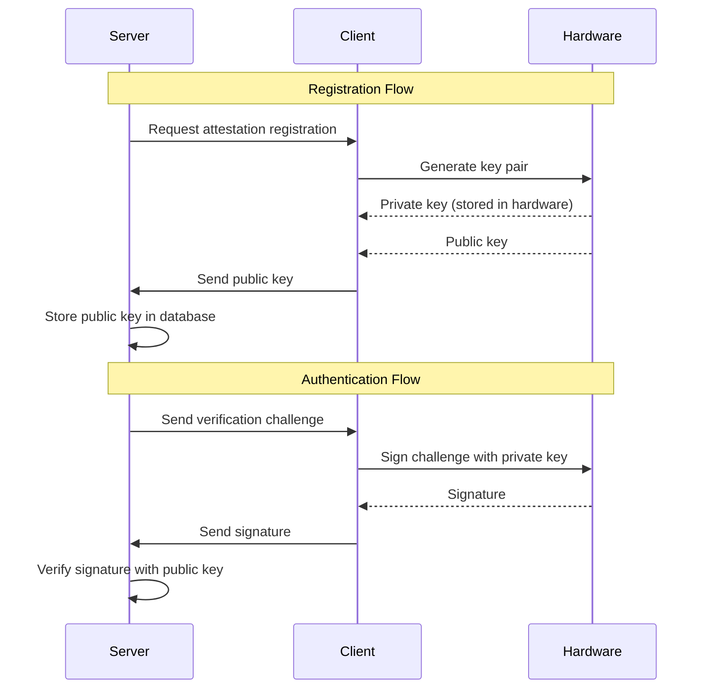

## What is Attestation?

Attestation is a hardware-backed authentication method that provides exceptional security for Minecraft servers. It's a modern 2FA (two-factor authentication) approach that leverages cryptographic keys stored securely in the user's device hardware.

<Info>
  Attestation stands out as a primary 2FA option due to its user-friendliness when compared to TOTP (Time-based One-Time Password) apps. TOTP can be effectively utilized as a secondary 2FA method for devices that don't support attestation.
</Info>

## How It Works

Attestation authentication uses public-key cryptography with hardware-backed key storage:



### Key Characteristics

<CardGroup cols={2}>
  <Card title="Hardware-Backed" icon="microchip">
    Private keys are generated and stored in secure hardware (TPM, Secure Enclave, etc.), never exposed to software.
  </Card>
  
  <Card title="Phishing-Resistant" icon="shield-halved">
    Unlike passwords or TOTP codes, attestation signatures are unique per challenge and can't be reused or intercepted.
  </Card>
  
  <Card title="User-Friendly" icon="hand-sparkles">
    Users authenticate with a simple device confirmation (fingerprint, PIN, etc.) instead of typing codes.
  </Card>
  
  <Card title="Cryptographically Secure" icon="lock">
    Uses modern elliptic curve cryptography (EC) with SHA256 hashing for strong security guarantees.
  </Card>
</CardGroup>

## Registration vs Signing Flow

### Registration Flow

Registration is a one-time setup process where the player establishes their attestation key with your server.

<Steps>
  <Step title="Server initiates registration">
    Your plugin sends an `OutAttestationRegister` packet to the client:
    
    ```java
    ECServerAPI api = ECServerAPI.getInstance();
    api.sendPacket(player, new OutAttestationRegister());
    ```
  </Step>
  
  <Step title="Client generates key pair">
    Ember Client requests the device hardware to generate a new cryptographic key pair. The private key remains securely stored in hardware.
  </Step>
  
  <Step title="Client sends public key">
    An `InAttestationRegister` packet is sent back containing:
    - Status (SUCCESS, SIGNING_NOT_ALLOWED, USER_CANCELLED, etc.)
    - Public key (if successful) in X.509 format
  </Step>
  
  <Step title="Server stores public key">
    Your plugin receives an `EmberAttestationRegisterEvent` and stores the public key:
    
    ```java
    @EventHandler
    public void onRegister(EmberAttestationRegisterEvent event) {
        if (event.getStatus() == AttestationRegisterResult.SUCCESS) {
            X509EncodedKeySpec publicKey = event.getPublicKey();
            database.storePublicKey(
                event.getPlayer().getUniqueId(), 
                publicKey.getEncoded()
            );
        }
    }
    ```
  </Step>
</Steps>

#### Possible Registration Results

<ResponseField name="SUCCESS" type="AttestationRegisterResult">
  Key pair generated successfully. The public key is available via `getPublicKey()`.
</ResponseField>

<ResponseField name="SIGNING_NOT_ALLOWED" type="AttestationRegisterResult">
  The user's device doesn't support hardware attestation. Offer TOTP as an alternative.
</ResponseField>

<ResponseField name="USER_CANCELLED" type="AttestationRegisterResult">
  The user cancelled the registration prompt on their device.
</ResponseField>

<ResponseField name="UNKNOWN_ERROR" type="AttestationRegisterResult">
  An unexpected error occurred during key generation.
</ResponseField>

### Signing Flow

Signing is performed each time you need to authenticate a player (e.g., login, sensitive operations).

<Steps>
  <Step title="Server generates challenge">
    Create random verification bytes and send them to the client:
    
    ```java
    byte[] challenge = new byte[32];
    new SecureRandom().nextBytes(challenge);
    
    // Store for later verification
    pendingChallenges.put(player.getUniqueId(), challenge);
    
    // Send to client
    api.sendPacket(player, new OutAttestationSign(challenge));
    ```
  </Step>
  
  <Step title="Client signs challenge">
    Ember Client asks the device hardware to sign the challenge bytes using the stored private key.
  </Step>
  
  <Step title="Client sends signature">
    An `InAttestationSign` packet is sent back containing:
    - Status (SUCCESS, KEY_DOES_NOT_EXIST, USER_CANCELLED, etc.)
    - Signed data (if successful)
  </Step>
  
  <Step title="Server verifies signature">
    Your plugin receives an `EmberAttestationSignEvent` and verifies the signature:
    
    ```java
    @EventHandler
    public void onSign(EmberAttestationSignEvent event) {
        if (event.getStatus() == AttestationSignResult.SUCCESS) {
            byte[] signature = event.getSignedData();
            byte[] challenge = pendingChallenges.get(event.getPlayer().getUniqueId());
            
            if (verifySignature(event.getPlayer(), challenge, signature)) {
                // Authentication successful
                grantAccess(event.getPlayer());
            }
        }
    }
    ```
  </Step>
</Steps>

#### Possible Signing Results

<ResponseField name="SUCCESS" type="AttestationSignResult">
  Challenge signed successfully. The signature is available via `getSignedData()`.
</ResponseField>

<ResponseField name="KEY_DOES_NOT_EXIST" type="AttestationSignResult">
  No attestation key has been registered. The user needs to register first.
</ResponseField>

<ResponseField name="SIGNING_NOT_ALLOWED" type="AttestationSignResult">
  The device doesn't support attestation or permission was revoked.
</ResponseField>

<ResponseField name="SIGN_DATA_INVALID" type="AttestationSignResult">
  The verification bytes sent by the server were invalid or corrupted.
</ResponseField>

<ResponseField name="USER_CANCELLED" type="AttestationSignResult">
  The user cancelled the signing prompt on their device.
</ResponseField>

<ResponseField name="UNKNOWN_ERROR" type="AttestationSignResult">
  An unexpected error occurred during signing.
</ResponseField>

## Security Benefits

Attestation provides several security advantages over traditional authentication methods:

<AccordionGroup>
  <Accordion title="Protection against password theft">
    Even if an attacker steals a player's password, they cannot authenticate without access to the player's physical device and biometric/PIN authentication.
  </Accordion>
  
  <Accordion title="Phishing resistance">
    Unlike TOTP codes that can be phished and immediately reused, attestation signatures are:
    - Unique to each challenge
    - Bound to the specific verification data
    - Impossible to replay
    
    An attacker cannot trick a user into providing a reusable authentication token.
  </Accordion>
  
  <Accordion title="No shared secrets">
    Traditional TOTP requires a shared secret between client and server. If the server is compromised, attackers can generate valid codes. With attestation:
    - Only the public key is stored on the server
    - The private key never leaves the hardware
    - Server compromise doesn't enable token generation
  </Accordion>
  
  <Accordion title="Hardware-bound authentication">
    The private key is cryptographically bound to the device's secure hardware:
    - Cannot be extracted or copied
    - Cannot be used on another device
    - Requires physical access and user confirmation
  </Accordion>
  
  <Accordion title="Modern cryptography">
    Uses industry-standard algorithms:
    - **Elliptic Curve (EC)** cryptography for key pairs
    - **SHA256** hashing for data integrity
    - **ECDSA** (Elliptic Curve Digital Signature Algorithm) for signatures
    
    These are the same standards used by banks, governments, and security-critical systems.
  </Accordion>
</AccordionGroup>

## How It Supplements Server Security

Attestation is designed to work alongside your existing security measures:

### Integration Patterns

<Tabs>
  <Tab title="Login 2FA">
    Require attestation verification during player login:
    
    ```java
    @EventHandler
    public void onPlayerLogin(PlayerLoginEvent event) {
        Player player = event.getPlayer();
        
        if (database.hasAttestationKey(player.getUniqueId())) {
            // Freeze player until authenticated
            frozenPlayers.add(player.getUniqueId());
            
            // Request attestation
            byte[] challenge = generateChallenge();
            pendingChallenges.put(player.getUniqueId(), challenge);
            api.sendPacket(player, new OutAttestationSign(challenge));
            
            player.sendMessage("Please verify your identity on your device.");
        }
    }
    ```
  </Tab>
  
  <Tab title="Sensitive Commands">
    Protect administrative or sensitive commands:
    
    ```java
    @EventHandler
    public void onCommand(PlayerCommandPreprocessEvent event) {
        String command = event.getMessage().toLowerCase();
        
        if (command.startsWith("/transfer") || command.startsWith("/pay")) {
            Player player = event.getPlayer();
            
            if (!isRecentlyAuthenticated(player)) {
                event.setCancelled(true);
                requestAttestation(player);
                player.sendMessage("Please verify to continue.");
            }
        }
    }
    ```
  </Tab>
  
  <Tab title="Session Verification">
    Periodically verify active sessions:
    
    ```java
    // Check every 30 minutes
    Bukkit.getScheduler().runTaskTimer(plugin, () -> {
        for (Player player : Bukkit.getOnlinePlayers()) {
            if (requiresReauth(player)) {
                requestAttestation(player);
            }
        }
    }, 0L, 36000L); // 30 minutes in ticks
    ```
  </Tab>
  
  <Tab title="Account Recovery">
    Verify identity during account recovery:
    
    ```java
    public void initiateAccountRecovery(Player player) {
        if (database.hasAttestationKey(player.getUniqueId())) {
            // Verify it's really the account owner
            requestAttestation(player);
        } else {
            // Fall back to other recovery methods
            sendEmailVerification(player);
        }
    }
    ```
  </Tab>
</Tabs>

### Layered Security Approach

Attestation works best as part of a comprehensive security strategy:

<Steps>
  <Step title="Password/Account Protection">
    Your existing authentication system (passwords, AuthMe, etc.) as the first layer.
  </Step>
  
  <Step title="Attestation as Primary 2FA">
    Offer attestation as the recommended 2FA method for compatible devices.
  </Step>
  
  <Step title="TOTP as Fallback">
    Provide TOTP-based 2FA for users whose devices don't support attestation.
  </Step>
  
  <Step title="Session Management">
    Track authenticated sessions with reasonable timeouts to balance security and UX.
  </Step>
</Steps>

## Technical Implementation Details

### Cryptographic Specifications

<CodeGroup>
```java Key Generation
// Keys are generated using Elliptic Curve cryptography
// The public key is encoded in X.509 format
X509EncodedKeySpec publicKey = event.getPublicKey();
byte[] encodedKey = publicKey.getEncoded();
```

```java Signature Verification
// Signatures use ECDSA with SHA256 hashing
KeyFactory keyFactory = KeyFactory.getInstance("EC");
PublicKey publicKey = keyFactory.generatePublic(keySpec);

Signature signature = Signature.getInstance("SHA256withECDSA");
signature.initVerify(publicKey);
signature.update(challengeBytes);

boolean valid = signature.verify(signedData);
```
</CodeGroup>

### Data Encoding

All binary data (keys, signatures, challenges) is Base64-encoded during transmission:

- **Public keys** are sent as Base64-encoded X.509 key specs
- **Signatures** are sent as Base64-encoded byte arrays
- **Challenges** are sent as Base64-encoded byte arrays

This encoding happens automatically in the packet serialization layer (via `ByteBufWrapper`).

## Limitations and Considerations

<Warning>
  Not all devices support hardware attestation. Always provide an alternative 2FA method (like TOTP) for users whose devices return `SIGNING_NOT_ALLOWED`.
</Warning>

<CardGroup cols={2}>
  <Card title="Device Compatibility" icon="mobile">
    Attestation requires compatible hardware:
    - Windows: TPM 2.0
    - macOS: Secure Enclave (Mac with Apple Silicon or T2 chip)
    - Linux: TPM 2.0 (varies by distribution)
    - Mobile: Platform-specific secure elements
  </Card>
  
  <Card title="User Experience" icon="user-check">
    Users must:
    - Have biometrics or PIN configured on their device
    - Approve each signing request
    - Have physical access to their registered device
  </Card>
  
  <Card title="Key Management" icon="database">
    Server operators must:
    - Securely store public keys
    - Implement key revocation mechanisms
    - Handle key rotation if needed
    - Back up key databases
  </Card>
  
  <Card title="Error Handling" icon="triangle-exclamation">
    Handle all possible failure states:
    - Device not supported
    - User cancellation
    - Network timeouts
    - Key verification failures
  </Card>
</CardGroup>

## Next Steps

<CardGroup cols={2}>
  <Card title="Implementation Guide" icon="code" href="/guides/attestation-registration">
    Follow our step-by-step guide to implement attestation in your plugin
  </Card>
  
  <Card title="Events Reference" icon="bolt" href="/concepts/events">
    Learn about the attestation events and how to handle them
  </Card>
  
  <Card title="Packet System" icon="box" href="/concepts/packets">
    Understand the underlying packet communication system
  </Card>
  
  <Card title="API Reference" icon="book" href="/api/ecserverapi">
    Explore the complete API documentation
  </Card>
</CardGroup>